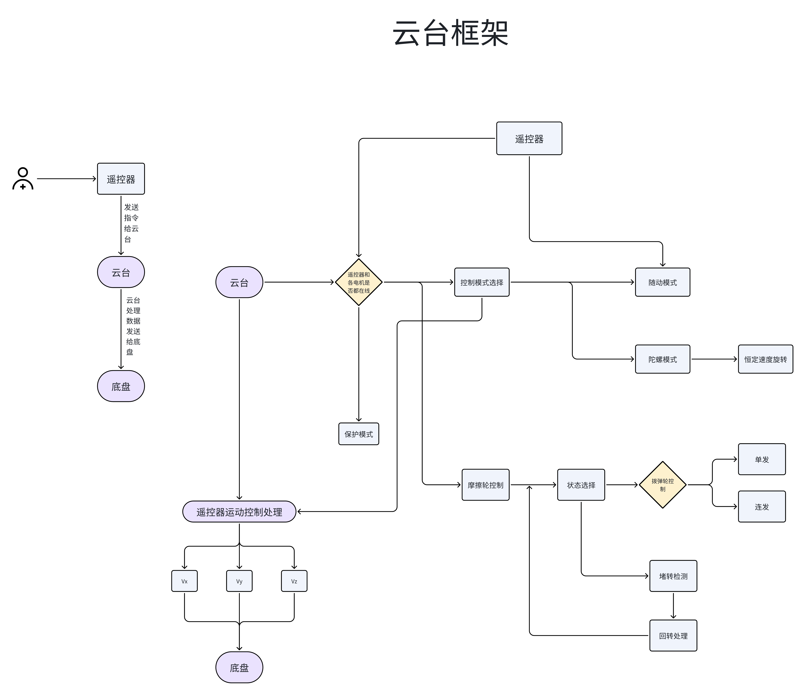

# *若有问题，请仔细阅读完该readme后，再于群中提问*

> 💡 **推荐阅读：「提问的艺术（RM版）」**
>
> 学会提问，才能真正学会解决问题。  
> 本文基于《How To Ask Questions The Smart Way》并结合 RoboMaster 圈经验撰写，  
> 是每一位队员必读的沟通指南。
>
> 👉 [点击阅读原文](https://bbs.robomaster.com/article/810096?source=1)

# 单头下供弹云台控制代码

## 简介

本套代码实现了对单头云台与下供弹发射机构的控制。

## 控制框图


## 项目概述

这是一个用于控制云台旋转和发射机构发弹的嵌入式C++项目。项目基于STM32F4系列微控制器（具体为STM32F407IGHx），使用大疆C型开发板，GM6020电机作为yaw轴和pitch轴电机，2006电机（搭配c610电调）或3508电机（搭配c620电调）作为拨弹轮电机，3508电机作为摩擦轮电机

主要功能包括：
- 云台运动控制（支持陀螺仪反馈和电机编码器反馈两种模式）
- 发射机构控制
- 通过CAN总线与电机驱动器通信，实现电机控制，也与底盘通信
  其中can1连接上端几个电机：pitch轴电机，两个摩擦轮电机；can2连接下端几个电机：yaw轴电机，拨弹轮电机，同时can2还负责与底盘的通信
- 通过UART接收遥控器指令（支持FSI6遥控器）
- 使用FreeRTOS进行任务调度
- 实现了PID控制器用于电机速度控制
- 实现了SM滑模控制器，专门控制yaw轴

## 项目结构

```
D:\Dev\EGA_Dev\EGA_GIMBAL_EXAMPLE\
├── Core/                     # STM32 HAL库核心代码
├── Drivers/                  # STM32 HAL驱动和CMSIS库
├── Middlewares/              # 中间件（FreeRTOS、ARM DSP库）
├── User/                     # 用户代码
│   ├── Framework/            # 核心控制逻辑（云台、发射机构、电机、PID、SMC、遥控器等）
│   ├── MCUDriver/            # MCU外设驱动（CAN、LED、UART）
│   └── Tasks/                # FreeRTOS任务
├── CMakeLists.txt            # CMake构建配置
└── README.md                 # 项目说明
```

## 核心文件

### 云台控制 (GimbalC)
- ​文件: `User/Framework/GIMBALC/gimbalc.h`, `User/Framework/GIMBALC/gimbalc.cpp`
- ​功能: 实现云台控制的核心逻辑
- ​主要特性:
  - 双轴（Yaw轴和Pitch轴）电机的位置环和速度环PID控制，滑模控制
  - 滑模控制(SMC)算法用于提高控制精度
  - 多种控制模式切换（编码器模式/陀螺仪模式）
  - 云台保护机制和故障检测
- ​支持的控制模式:
  - 随动模式(SUIDONG) - 底盘跟随云台转动
  - 陀螺模式(TUOLUO) - 底盘自主旋转
  - 键盘控制(TOKEY_MODE)和遥控器控制(TORC_MODE)
- ​通信接口:
  - 通过CAN总线与GM6020电机通信（Yaw轴和Pitch轴）
  - 通过UART接收遥控器指令（支持DT7->DR16和FSi6x<->ia10b两种遥控器协议）
- ​集成功能:
  - 射击系统控制，包含摩擦轮和拨弹盘状态管理
  - 支持Matlab生成的PID控制器，便于参数整定和算法验证


### 射击控制 (ShootC)

文件: `User/Framework/SHOOTC/shootc.h`, `User/Framework/SHOOTC/shootc.cpp`

功能: 实现射击系统的核心控制逻辑

主要特性:
- 三电机协同控制（拨弹盘和双摩擦轮）
- 拨弹盘的位置环PID控制和速度环PID控制
- 摩擦轮的速度环PID控制
- 卡弹检测与自动恢复机制
- 支持单发和连发两种射击模式

支持的控制模式:
- 键盘控制模式(KEY_MODE) - 通过鼠标点击触发单发
- 遥控器控制模式(RC_MODE) - 通过遥控器通道控制连发
- 支持DT7->DR16和FSi6x<->ia10b两种遥控器协议

安全保护机制:
- 摩擦轮速度检测，确保达到安全转速才允许射击
- 电机在线状态监控
- 堵转检测和自动反转恢复
- 斜坡控制避免速度突变

通信接口:
- 通过CAN总线与电机通信

集成功能:
- 与云台系统协同，由云台决定是否射击


### 遥控器控制 (RemoteC)

文件​： `User/Framework/REMOTEC/remotec.h`,`User/Framework/REMOTEC/remotec.cpp`
功能​：实现遥控器数据的接收、解析和控制指令生成

## 主要特性
- 支持多种遥控器协议（DT7->DR16和FSi6x<->ia10b），通过宏定义灵活切换
- 基于DMA和串口空闲中断的高效数据接收机制
- 完整的遥控器通道数据解析，包括摇杆、开关、鼠标和键盘数据
- 双重控制模式支持（遥控器模式/键盘鼠标模式）

## 支持的控制模式
- 遥控器模式(RC_MODE)​ - 使用传统遥控器进行操作
- 键盘模式(KEY_MODE)​ - 支持键盘鼠标的计算机控制方式（仅使用DR16遥控器时有效）

## 通信接口
- 通过UART3接口接收遥控器SBUS信号
- 使用DMA双缓冲机制确保数据接收的完整性和实时性

## 集成功能
- 云台控制指令生成（Yaw轴和Pitch轴转速）
- 底盘运动控制（前后速度Vx和左右速度Vy）
- 工作模式切换（随动模式/陀螺模式）
- 射击系统状态管理（摩擦轮开关、射击模式）
- 遥控器在线状态检测和异常数据处理
- 支持自瞄、重绘等特殊功能按键处理


### PID控制器 (PidC)
- 文件: `User/Framework/PID/normal_pid.h`, `User/Framework/PID/normal_pid.cpp`
- 实现了位置式和增量式PID控制算法
- 用于电机速度控制


### 滑模控制器（SMC）
- 文件：`User/Framework/SMC/slidingmodec.h`，`User/Framework/SMC/slidingmodec.cpp`
- 实现了滑模控制算法
- 用于yaw轴电机控制

## 构建和烧录

### 构建系统
项目使用CMake作为构建系统，目标平台为ARM Cortex-M4。

### 编译器
- 使用 `arm-none-eabi-gcc` 工具链进行交叉编译
- C++标准: C++17
- C标准: C11

### 构建配置
- 处理器: Cortex-M4
- 浮点运算: 硬件浮点 (hard float)
- 优化选项: 根据构建类型设置 (-Ofast, -Os, -Og等)


### 烧录
项目生成.HEX和.BIN格式的固件文件，可以使用Dap-Link或其他兼容的调试器进行烧录。

## 开发约定

1. 代码使用C++17标准编写
2. 使用STM32 HAL库进行硬件抽象
3. 使用FreeRTOS进行多任务管理
4. 电机控制采用PID算法进行速度闭环控制
5. 通过CAN总线与电机驱动器通信
6. 通过UART接收遥控器指令
7. 使用CMake进行项目构建

## 关键配置参数

1. Yaw轴和Pitch轴的电机反馈类型、电机控制算法、减速比和电机极性在 `User/Framework/GIMBALC/gimbalc.h"` 中通过 `motors` 变量声明时配置
2. 摩擦轮和拨弹轮的电机减速比、电机极性在 `User/Framework/SHOOTC/shootc.h"` 中通过 `motors` 变量声明时配置
3. Yaw轴电机的滑模参数和Pitch电机的PID参数在 `User/Framework/GIMBALC/gimbalc.cpp`的`CarChoose`函数中定义
4. 注意电机的极性：极性错了会导致正反馈，即越偏越远。如果发现错了就及时把极性取反
5. 摩擦轮和拨弹轮的PID参数在 `User/Framework/SHOOTC/shootc.h` 中的`ram_pos_pid`和`speed_pids[3]`声明
6. 遥控器类型在 `remotec.h` 中通过宏定义选择。
_FSi6x控制方式见 `User/Framework/REMOTEC/remote_readme.md`_
[fsi6x控制方式](User/Framework/REMOTEC/remote_readme.md)

## 主要任务

项目使用FreeRTOS进行任务调度，主要任务在 `User/Tasks/` 目录中定义。

### 在群里问问题之前，你应该:
1. 善用搜索
2. 问你所在的小组的成员，每个小组都有至少一名战队成员
3. 在以上两步均没有结果后，再在群里提问

在群里提问时，请先简述你上网查询以及与组员讨论的结果，让我们知道你已经仔细阅读readme并按照步骤提问。